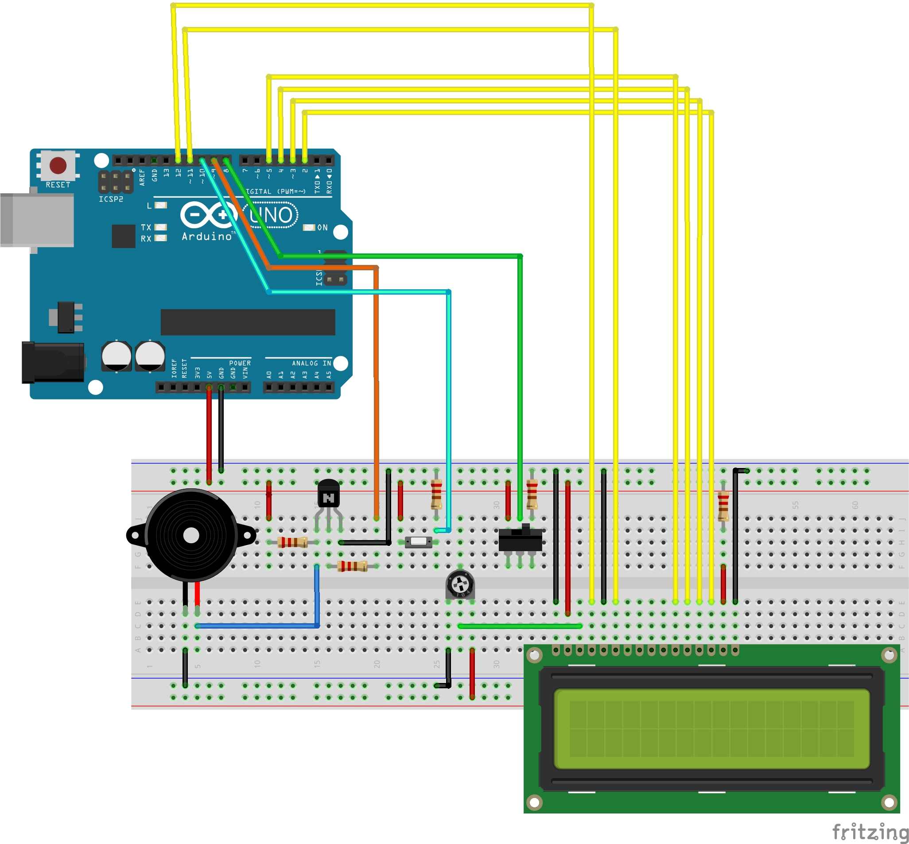

# bombuino
Simple Arduino Airsoft Bomb Dummy

**NOTE: This it NOT a real bomb! It's just an Arduino that acts like a bomb and makes a noise if it 'detonates'!!**

## Description
This Airsoft-Bomb is made as simple as possible. It doesn't include a Pinpad, instead you have a single button, which must be pressed for 5 seconds to arm/defuse the bomb.
The time can be set in the so-called 'op-mode' or 'game-master-mode'. After that, the game-master locks the time by using a keyswitch. Then the Bomb reaches the 'ready'-mode, where it can be armed.
After arming the bomb starts to count down the time, set by the game-master and beeps every second.

While counting down, it can be defused by pressing the pushbutton for another 5 seconds.

If it 'detonates', the bomb beeps for 5 seconds and waits for the game-master to reset it by using the keyswitch.

## Needed parts
* Ardunio
* 1x16 LCD
* A Pushbutton
* A Keyswitch
* 220Ohm Resistor
* ~10Ohm Resistor 
* NPN-Transistor (BC337, BC547, 2N3904, ...)
* Speaker

## Breadboard

